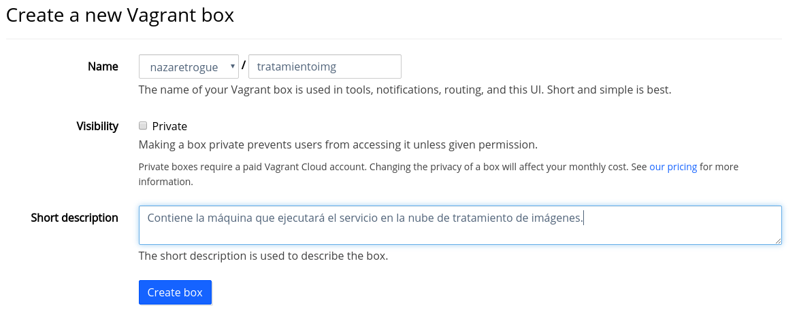

# Creación de la máquina en local y VagrantCloud

## Tabla de contenidos
<!--ts-->
   * [Creación de la máquina](#Creacion-de-la-maquina)
   * [Subiendo la máquina virtual a VagrantCloud](#Subiendo-la-máquina-virtual-a-VagrantCloud)
   * [Bibliografía](#Bibliografia)
<!--te-->

## Creación y provisión de la máquina

Para crear la máquina ya provisionada se puede utilizar el comando

```bash
vagrant up
```

que crea la máquina y la provisiona según el archivo que se haya indicado en
el *Vagrantfile*. En el caso de la imagen que hay a continuación, dicha máquina
ya estaba creada y provisionada, como se puede observar:


No obstante, a pesar de que se puede ver que se ha ejecutado mediante el comando,
está automatizado en la herramienta de construcción, el [*Makefile*](https://nazaretrogue.github.io/Microservicio-multimedia/Tecnologias_usadas)
donde se ha documentado también qué hace este comando pero de forma automatizada.

También se puede crear la máquina sin provisionar con

```bash
vagrant up --no-provision
```

para así hacer la provisión desde Ansible manualmente. Para ello, se utiliza el
comando

```bash
ansible-playbook playbook.yml
```

que genera una salida como la que se ve abajo. Cuando hay algún fallo de cualquier
tipo, la salida informa del error.


Al igual que en el caso de la creación de la máquina, este comando está automatizado
y documentado en el [*Makefile*](https://nazaretrogue.github.io/Microservicio-multimedia/Tecnologias_usadas).
Cuando se ejecuta

```bash
make vm-provision
```

primero se crea la máquina sin provisionar y automáticamente después se provisiona
con Ansible.

## Subiendo la máquina virtual a VagrantCloud

Para que la máquina creada sea pública y accesible, la vamos a subir a VagrantCloud.
Para ello, creamos una cuenta en la plataforma y una vez hecho, automáticamente nos
redirige al dashboard, desde donde podemos crear una box donde subirla.


Tras crearla nos pedirá algunos datos sobre la máquina que vamos a subir, entre
ellos el nombre, la visibilidad, una descripción e incluso la versión, la cual
sigue unas pautas según el stage de desarrollo en el que se encuentra la máquina.
Las pautas se pueden ver [aquí](https://guides.rubygems.org/patterns/#semantic-versioning).



Una vez creada, soy hay que generar un archivo comprimido que contiene la imagen
de la máquina con el comando:

```bash
vagrant package --output tratamientoimg
```

Una vez tenemos el archivo, debemos añadirlo a la box creada en VagrantCloud. Con
el tamaño del archivo varía un poco el tiempo: puesto que mi máquina tiene casi 800MB
tarda un poco en subirse a VagrantCloud.

Una vez subida, la imagen estará disponible [aquí](https://app.vagrantup.com/nazaretrogue/boxes/tratamientoimg).
