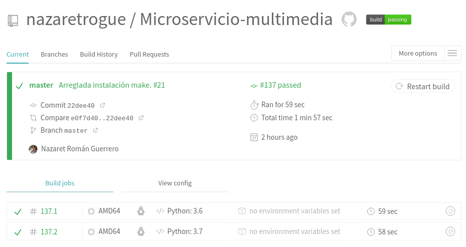

# Índice
  + El qué, el cómo y el porqué
  + Lenguaje, herramientas y bibliotecas
    - Expectativa vs realidad
  + Java: la Odisea
  + Integración continua

# El qué, el cómo y el porqué
  + Es un microservicio: se encarga de procesar imágenes.
  + Recibe una imagen y la convierte en escala de grises.
  + Idea original: filtro termal.

# Lenguaje, herramientas y bibliotecas
  + Implementación en *Python3*.
  + Bróker de mensajería: *RabbitMQ*.
  + Bibliotecas: *Pillow*, *pika*.
  + Microframework: *Flask*.
  + Herramienta de construcción: *Makefile*.

{ width=40px, height=150}

# Expectativa vs realidad
  + Implementado con *Python*
{ width=60px, height=100px }\ { width=60px, height=100px}

  + Implementado con *Java*: idea original
{ width=60px, height=100px }\ { width=60px, height=100px}

# Java: la Odisea
  + Herramienta de construcción: *maven* vs *ant*.
  + IDE: *netbeans*.
  + *RabbitMQ* con *OracleJDK*. *ActiveMQ*.
  + Servidores en *netbeans* vs servidores reales.
  + *ant* en *TravisCI*.
  + Desenlace: mejor usar *Python*.

# Test unitarios y funcionales
  + Comprueban que la imagen sea RGB.
  + Comprueban que el microservicio esté funcionando.
    - (**GET** /status)
  + Comprueban que se devuelve la imagen procesada.
    - (**GET** /procesado.png)
  + Falta un tercer test funcional: envio de la imagen a procesar. Problemas de codificación.

# Integración continua
  + *TravisCI*: .travis.yml

  + *Shippable*: shippable.yml

# Despliegue
  + En un Paas: Heroku.
    - https://tratamientoimg.herokuapp.com/
  + Con contenedores:
    - https://tratamientoimg.herokuapp.com/
    - https://tratamientoimg.azurewebsites.net/
    - Enlace a DockerHub:
      - https://hub.docker.com/r/nazaretrogue/tratamientoimg

# Provision con Ansible y Vagrant
  + ansible.cfg
  + ansible_hosts
  + playbook.yml
  + Vagrantfile
  + No se lleva a cabo el despliegue.
    - *Connection refused*

# Gracias por su atención
+ ¿Alguna pregunta?

{ width=280px, height=271px }
