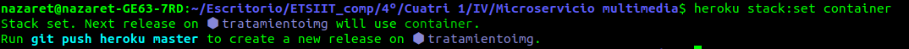
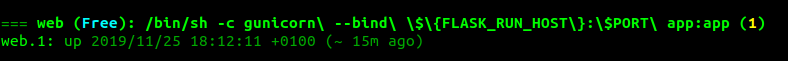
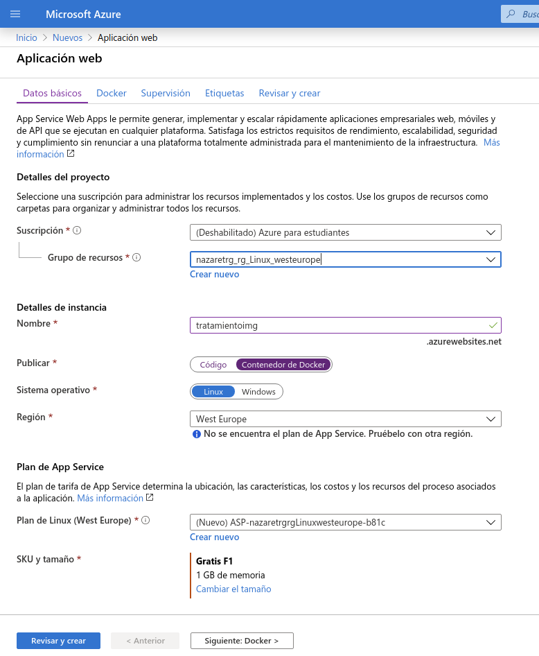
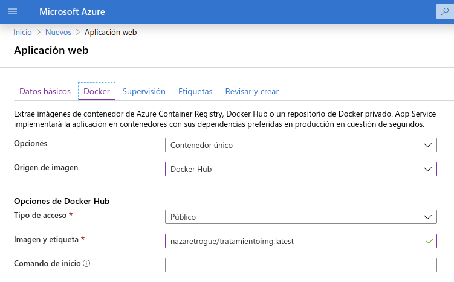
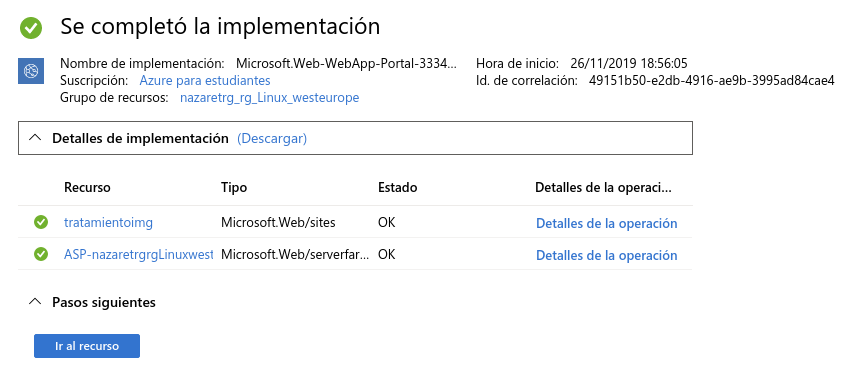
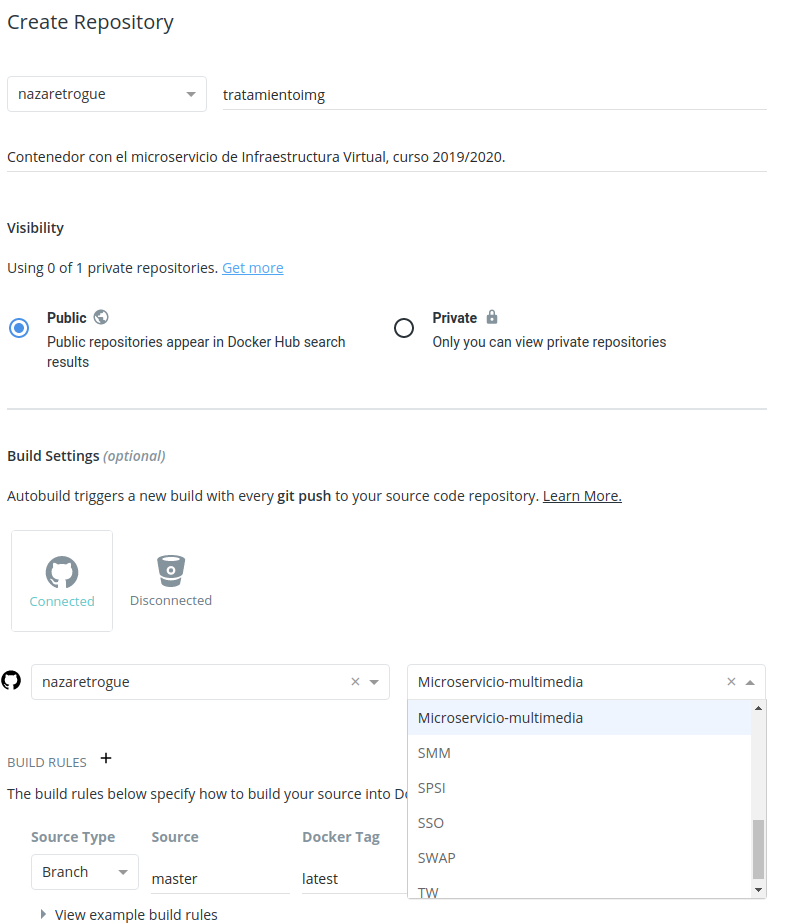

# Despliegue en un PaaS con contenedores

## Tabla de contenidos
<!--ts-->
   * [Creación de la app en Heroku con contenedores](#Creacion-de-la-app-en-Heroku-con-contenedores)
   * [Creación de la app en Azure con contenedores](#Creacion-de-la-app-en-Azure-con-contenedores)
   * [La aplicación en DockerHub](#La-aplicación-en-DockerHub)
   * [Bibliografía](#Bibliografia)
<!--te-->

## Creación de la app en Heroku con contenedores

Puesto que la aplicación está ya creada, ahora solo hay que indicarle que se
hará a través de contenedores. Para ello nos logueamos en el CLI de *Heroku*
con la orden que ya hemos visto,

```bash
heroku login
```

que nos redigirá a una ventana en el navegador para loguearnos. Una vez hecho
esto, tenemos que indicar que la app correrá en un contenedor. Para ello, ejecutamos

```bash
heroku stack:set container
```

que devolverá una salida como se puede apreciar en la imagen.



Es decir, nos indica que nuestra app será ahora lanzada desde un contenedor, y que
para aplicar los cambios debemos hacer

```bash
git push heroku master
```

No obstante, puesto que nuestro GitHub está configurado para que al hacer simplemente

```bash
git push
```

se redespliegue nuestra aplicación (esa configuración está explicada [aquí](https://nazaretrogue.github.io/Microservicio-multimedia/PaaS))
simplemente llevando a cabo la ejecución de este último comando se actualizará la
configuración del despliegue de la app.

Una vez hecho esto, ya tendríamos nuestra aplicación corriendo. Para comprobar que
en efecto está funcionando, mostramos el estado con

```bash
heroku ps
```



Como podemos comprobar, el servicio está levantado y funcionando.

## Creación de la app en Azure con contenedores

El despliegue del contenedor en [*Azure*](azure.microsoft.com) es aún más sencillo.
Para ello, debemos crear un nuevo recurso, concretamente una aplicación web. Una
vez en la página de creación rellenamos con los datos de la aplicación tal y como
se ve en la imagen:



Tras esto, el siguiente paso es conectar la app con *DockerHub*. Si la aplicación
está subida ahí, *Azure* es capaz de extraerla de éste y desplegarla. Los datos
que piden son los siguientes:



Tras esto, se muestran dos páginas más de información y ya se puede desplegar la
app, aunque antes hace ciertas comprobaciones para saber que todos los datos
introducidos anteriormente están correctos.



Con esto hemos comprobado que la aplicación está correcta para desplegar.

## La aplicación en DockerHub

Para subir la aplicación a [*DockerHub*](https://hub.docker.com/), solo debemos
crear un repositorio en esta plataforma y conectarla con el repositorio de *GitHub*.

Para ello, pulsamos el botón de *Create repository* y lo conectamos con *GitHub*
tal y como se ve en la imagen:


